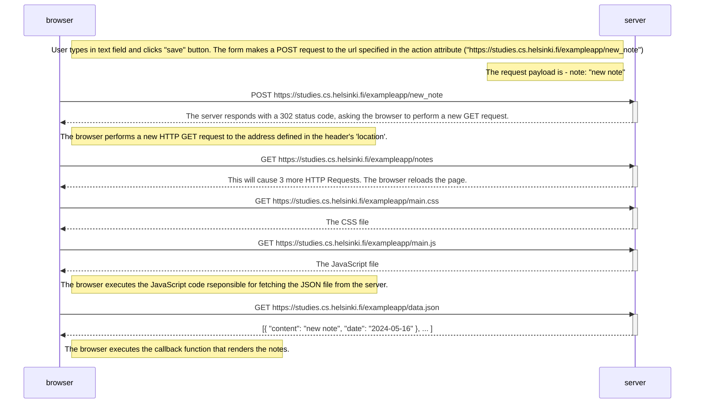

```mermaid
sequenceDiagram
participant browser
participant server

    Note right of browser: User types in text field and clicks "save" button. The form makes a POST request to the url specified in the action attribute ("https://studies.cs.helsinki.fi/exampleapp/new_note")
    Note left of server: The request payload is - note: "new note"
    browser->>server: POST https://studies.cs.helsinki.fi/exampleapp/new_note
    activate server
    server-->>browser: The server responds with a 302 status code, asking the browser to perform a new GET request.
    deactivate server

    Note right of browser: The browser performs a new HTTP GET request to the address defined in the header's 'location'.
    browser->>server: GET https://studies.cs.helsinki.fi/exampleapp/notes
    activate server
    server-->>browser: This will cause 3 more HTTP Requests. The browser reloads the page.
    deactivate server

    browser->>server: GET https://studies.cs.helsinki.fi/exampleapp/main.css
    activate server
    server-->>browser: The CSS file
    deactivate server

    browser->>server: GET https://studies.cs.helsinki.fi/exampleapp/main.js
    activate server
    server-->>browser: The JavaScript file
    deactivate server

    Note right of browser: The browser executes the JavaScript code rseponsible for fetching the JSON file from the server.

    browser->>server: GET https://studies.cs.helsinki.fi/exampleapp/data.json
    activate server
    server-->>browser: [{ "content": "new note", "date": "2024-05-16" }, ... ]
    deactivate server

    Note right of browser: The browser executes the callback function that renders the notes.
```
