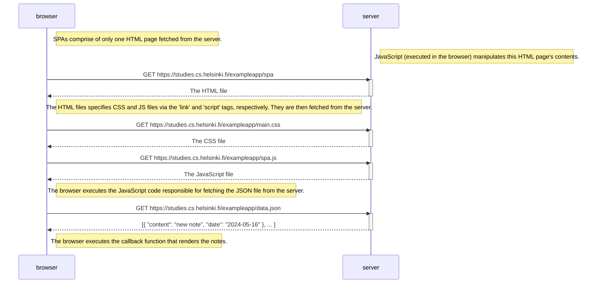

```mermaid
sequenceDiagram
participant browser
participant server

    Note right of browser: SPAs comprise of only one HTML page fetched from the server.
    Note right of server: JavaScript (executed in the browser) manipulates this HTML page's contents.
    browser->>server: GET https://studies.cs.helsinki.fi/exampleapp/spa
    activate server
    server-->>browser: The HTML file
    deactivate server

    Note right of browser: The HTML files specifies CSS and JS files via the 'link' and 'script' tags, respectively. They are then fetched from the server.
    browser->>server: GET https://studies.cs.helsinki.fi/exampleapp/main.css
    activate server
    server-->>browser: The CSS file
    deactivate server

    browser->>server: GET https://studies.cs.helsinki.fi/exampleapp/spa.js
    activate server
    server-->>browser: The JavaScript file
    deactivate server

    Note right of browser: The browser executes the JavaScript code responsible for fetching the JSON file from the server.

    browser->>server: GET https://studies.cs.helsinki.fi/exampleapp/data.json
    activate server
    server-->>browser: [{ "content": "new note", "date": "2024-05-16" }, ... ]
    deactivate server

    Note right of browser: The browser executes the callback function that renders the notes.
```
