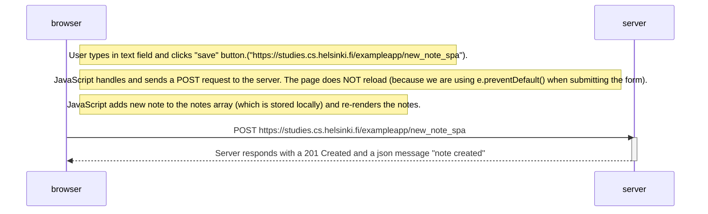

```mermaid
sequenceDiagram
participant browser
participant server

    Note right of browser: User types in text field and clicks "save" button.("https://studies.cs.helsinki.fi/exampleapp/new_note_spa").

	Note right of browser: JavaScript handles and sends a POST request to the server. The page does NOT reload (because we are using e.preventDefault() when submitting the form).

	Note right of browser: JavaScript adds new note to the notes array (which is stored locally) and re-renders the notes.

    browser->>server: POST https://studies.cs.helsinki.fi/exampleapp/new_note_spa
    activate server
    server-->>browser: Server responds with a 201 Created and a json message "note created"
    deactivate server

```
